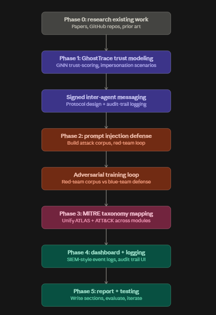

## Roadmap

## Research References

**GhostTrace (trust scoring) — papers**

* **"To trust or not to trust: Attention-based Trust Management for LLM Multi-Agent Systems"** — Introduces the Attention Trust Score (A-Trust), a lightweight attention-based method for evaluating message trustworthiness across six orthogonal trust dimensions. It also presents a trust management system with both message-level and agent-level assessments. arXiv 2506.02546. This is one of the closest papers to the GhostTrace problem statement.

* **"The trust paradox in LLM-based multi-agent systems: When collaboration becomes a security vulnerability"** — Useful for understanding how trust itself can become a security vulnerability in LLM-based multi-agent systems, rather than being only a mechanism for improving collaboration.

* **"Red-Teaming LLM Multi-Agent Systems via Communication Attacks"** — Useful for understanding communication-based attacks in multi-agent systems and for designing impersonation and rogue-delegation attack scenarios.

* **"NetSafe: Exploring the Topological Safety of Multi-Agent System"** — Relevant to GhostTrace because it studies safety from a topology perspective, which connects naturally with graph-based approaches to trust scoring.

**Prompt injection defense — projects/benchmarks**

* **Open-Prompt-Injection** — An open-source benchmark toolkit for implementing, evaluating, and extending prompt-injection attacks and defenses. This can be useful as a reference for building the attack corpus.

* **AgentDojo** and **InjecAgent** — Benchmarks focused on prompt injection attacks against LLM-based agents. Their attack scenarios and taxonomies can be studied as references for the SentinelMesh attack corpus.

* **DeepTeam** — A red-teaming framework that includes multiple adversarial attack methods, including prompt injection. It can be studied to understand existing approaches to automated red-teaming.

* **"Formalizing and Benchmarking Prompt Injection Attacks and Defenses"** — A useful reference for understanding existing prompt-injection taxonomies and evaluation methodologies.

**MITRE taxonomy**

The existing work above provides useful references for trust management, communication attacks, prompt injection, and red-teaming. The ATLAS + ATT&CK unification planned for SentinelMesh will require further study of the MITRE frameworks and their applicability to multi-agent systems.

